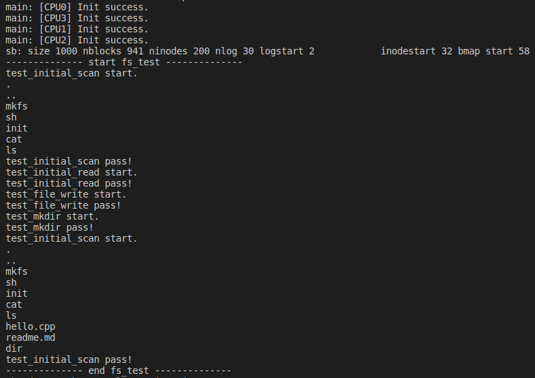

# Lab 7 实验报告

- 于凡奇 18307130182

[toc]

## 0 概述

由于本次 Lab 内容较多，为了突出重点，我将个人认为比较有意思的部分以"*"标注，如 1.1.3 和 3.1 小节。

## 1 文件系统

### 1.1 Buffer cache layer

这是操作系统与硬件连接的第一层，它具有两个主要作用：（1）同步磁盘块的访问，对于一个磁盘块保证内存中最多只有一份拷贝；（2）对频繁使用的磁盘块起到缓存的作用，加快磁盘访问速度。

Buffer cache layer 为上层提供的界面主要包括 `bread`, `bwrite`, `brelse` ，其中 buffer cache 由一个双向循环链表实现。

#### 1.1.1 bread

`bread` 通过 `bget` 获取所需的 buffer 块。`bget` 扫描 buffer 列表寻找指定的扇区，找到后为其加锁并返回。如果该扇区不在 buffer 中，`bget` 就需要为其分配一块 buffer，同时可能需要先将某块 buffer 释放，类似 cache 的替换。在这一过程中，`bget` 通过对 `bcache` 加锁来保证扫描 buffer 列表和为新扇区分配 buffer 两个操作的连贯性、原子性，这样就不会出现一个扇区对应两块 buffer 的情况。

#### 1.1.2 bwrite

在 `bread` 顺利返回一块 buffer 后，它的调用者便可以独享地使用这块 buffer 而不需要担心与别的进程冲突。在修改 buffer 时，需要用到 `bwrite` ，而 `bwrite` 通过调用 SD 卡驱动中的 `sdrw` 对 SD 卡进行更新。

#### 1.1.3 brelse*

`brelse` 在放锁的同时进行了一些简单的操作，这些操作却能十分巧妙地提高 buffer 的效率。

前面 `bget` 加的睡眠锁在此处释放，同时将此块 buffer 移动至链表前端。这样的移动使得最近常被使用的 buffer 都在链表中靠前的位置，因此在考虑替换 buffer 时只需从后往前寻找第一个空闲的 buffer ，便可达到类似于 **LRU 算法**的效果。另一方面，在查找 buffer 时，在列表中从前往后检索，则快速命中的概率也能提高：常用的 buffer 集中在前端，相当于构造了 buffer 访问时的**局部性**。

### 1.2 Logging layer

文件系统需要着重考虑的要点之一就是**可持久性**，这一点由日志层可较好地实现。

#### 1.2.1 文件系统崩溃的场景

假设在将某个文件截短至长度0（删除）的过程中文件系统崩溃了，这时可能出现两种情况：（1）某一磁盘块已被标记为空闲，但实际上仍有 inode 指向它；（2）inode 已经不再指向磁盘块，但磁盘块未被标记为空闲。

第一种情况可能导致多个 inode 之间非法地共享磁盘块，造成数据泄露或被篡改；第二种情况稍微好些，却也会导致磁盘空间的流失。

#### 1.2.2 日志的作用

文件系统崩溃时最大的问题在于其**不一致性**：如果能保持一致性，就算文件更新失败也是可以接受的，只要下次启动时重做即可。为此，需要将每次磁盘更新的一系列操作打包在一起，将其视作事务，保证其原子性。通过日志我们恰好能做到这点。

在需要对磁盘进行写入时，文件系统先向日志文件中记录本次即将进行的操作，记录结尾以一条特殊的“提交”记录结尾，表明本次向日志中的写入成功完成未被打断。接着系统将日志中记录的更改真正应用到磁盘上，应用完成后删除这段日志。

如果系统在这期间崩溃，它将以恢复模式启动：如果发现日志中有已提交的完整记录，系统就将日志中的更改应用到磁盘上；否则忽略日志并将其删除。前一种情况说明可能有进行到一半的更改，那么将其完成；后一种情况说明更改还未开始，因此可以忽略。

### 1.3 Inode layer

Inode 既指磁盘中的数据结构，也指内存中对前者的拷贝。由于内存容量有限，系统仅在内存（icache）中保留那些正在使用的 inode 。具体来说，通过 inode 的 ref 属性来看它被引用的次数，`iget` 和 `iput` 对 ref 进行增减，当 ref 等于0时意味着它已不再被使用，因而可以被系统清出内存了。

类似之前的 bcache.lock，icache 也使用锁来保证每个 inode 在 icache 中是唯一的。同时，每个 inode 自己也拥有一把锁，来保证自身的相关信息如 ref 被正确地访问和修改。

Inode cache 与 buffer cache 类似但也有不同：它的主要意义在于同步与协调多个进程对于 inode 的访问，至于作为缓存提高效率的作用则不大，因为 buffer cache 已经完成了大部分的缓存。

### 1.4 测试

此处采用谭大爷提供的 fs_test 对文件系统进行测试：

## 2 系统调用

本系统使用 musl 库，并为之实现了一系列系统调用和额外的内存管理函数。其中由 exec init 开始，进入用户态程序执行一系列的调用。最终能够成功启动 shell，并使用 ls, cat 命令。

## 3 其他工作

### 3.1 对头文件的优化*

在 make 时注意到部分头文件之间出现了循环包含的情况，导致部分函数无法被声明，因此将头文件中的函数声明方式进行了重构。具体来说，原来的头文件中不再带有函数声明，如 file.h, fs.h 等。将所有的函数声明集中到一个头文件 defs.h 中，令所有的 .c 文件包含它。而原来的各个头文件只保留必要的结构体声明、宏定义等。这样所有函数的声明都在一处，就不会存在上述循环依赖的情况。

## 4 致谢

感谢在此期间给予我极大帮助的谭大爷、洪嵚学长、韩老师、许大爷等多位大佬，没有他们我便不可能如此顺利地完成本次 lab :)